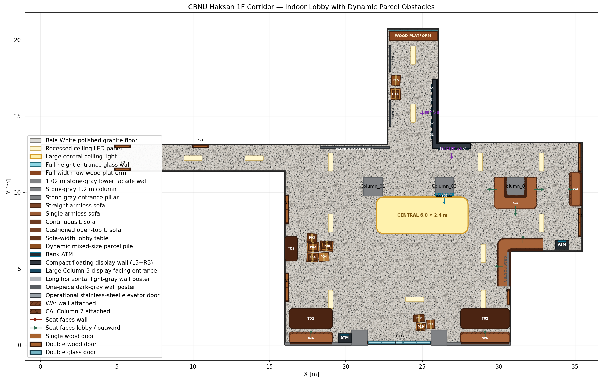

# CBNU 학연산 1층 로비 Isaac Sim 월드

충북대학교 학연산공동기술연구원 1층 피난안내도를 바탕으로 제작한 Isaac Sim용 실내 로비 월드다.

실측 CAD 복제가 아니라 안내도와 현장 이미지를 기준으로 비율과 동선을 근사한 환경이다. 현재 버전은 로비·복도 구조, 가구, 출입문, 전시 구조물, 엘리베이터 철문, 실내 조명과 물리 반응형 택배 박스를 포함한다.

## 빠른 시작

기준 Stage:

<code>worlds/cbnu_haksan_1f_corridor/cbnu_haksan_1f_corridor.usda</code>

Isaac Sim GUI에서 위 파일을 연다. 프로젝트 내부 USD는 상대경로 reference를 사용하므로 <code>assets/</code>와 <code>worlds/</code>의 상대 위치를 유지해야 한다.

~~~bash
cd /home/a/Isaac_Worlds
./scripts/test_world_with_isaac_usd.sh
~~~

수정한 하위 layer가 GUI에 바로 반영되지 않으면 열린 Stage를 닫고 기준 Stage를 다시 연다.

## 현재 월드 요약

| 구분 | 현재 구성 |
| --- | --- |
| 기준 단위 | meter, Z-up |
| 전체 범위 | 약 35.6 × 20.8m |
| 외곽 구조 | 높이 3.0m, 두께 0.20m의 직각 벽 12개 + 정면 낮은 외벽 2개 |
| 바닥 | Bala White 계열 polished granite |
| 천장 | 높이 3.0m, 두께 0.10m의 흰색 무광 천장 |
| 조명 | 일반 LED 패널 15개 + 중앙 6.0 × 2.4m 대형 패널 1개 |
| 기둥 | 1.2 × 1.2 × 3.0m 메인 기둥 3개 + 정문 측면 기둥 2개 |
| 문 | 목재 single 4개, 목재 double 4개, 정문 양개 유리문 2세트 |
| 가구 | 소파 5개, 하부가 채워진 책상 3개, ATM 2개 |
| 전시 구조 | L자 전시벽 1개, Column 03 대형 화면 1개, 회색 포스터 2개 |
| 엘리베이터 | Wall 05 스테인리스 중앙개폐식 철문 2개 |
| 북측 단상 | 통유리 앞 3.1332 × 0.60 × 0.15m 목재 단상 1개 |
| 동적 장애물 | Table 03 앞 9개 + 정문 안쪽 4개 + 엘리베이터 사이 3개, 총 16개 택배 박스 |
| 하늘 | DomeLight 기본 흰색 배경, intensity 1600 |

## 공간별 구성

### 메인 로비

- 메인 기둥은 <code>Column_01</code>, <code>Column_03</code>, <code>Column_02</code> 순으로 배치된다.
- <code>Column_03</code>은 바깥쪽 두 기둥의 정확한 중점에 있으며 정문 방향 면에 1.0 × 1.45m 화면 1장이 달려 있다.
- <code>Column_02</code>는 상단이 열린 U형 소파가 둘러싸며 소파 안쪽 면과 기둥 사이 clearance는 0이다.
- 로비 동쪽과 남쪽에는 벽 부착 소파·책상과 ATM이 배치돼 있다.
- 정문 오른쪽 <code>Wall_11</code>에는 <code>Door_Single_04</code>와 밝은 회색 <code>GrayPoster_01</code>이 있다.

### 서쪽 복도와 책상 구역

- 서쪽 복도 중심선은 y=12.2753m, 폭은 1.73m다.
- 끝 벽 <code>Wall_07</code>은 불투명하며 collision을 유지한다.
- 서쪽 두 문 사이의 <code>Table_03</code>은 기존 소파 자리를 대체한다.
- 책상 전면과 약 0.60m를 띄운 위치에 서로 다른 크기의 택배 박스 9개가 5-3-1의 3단으로 쌓여 있다.

### 북측 복도, 통형 포스터와 엘리베이터

<code>GrayPoster_02</code>는 <code>Wall_06</code>에 붙은 단일 통형 포스터다.

| 항목 | 값 |
| --- | --- |
| 위치 | (20.5892, 13.0403, 0.85) |
| 방향 | yaw 0°, 로비 -Y 방향 |
| 크기 | 4.5 × 1.22 × 0.15m |
| 색상 | (0.34, 0.36, 0.38) 진회색 |
| 구조 | 비발광 <code>PosterSlab</code> Cube 1개 |
| 물리 | 별도 collider 없음 |

포스터 오른쪽 코너를 돌아 들어가는 북측 복도의 <code>Wall_05</code>에는 운영 중인 엘리베이터 위치를 나타내는 철문 2개가 있다.

| Prim | 위치 | 크기 | 방향 |
| --- | --- | --- | --- |
| <code>ElevatorDoor_01</code> | (22.8392, 15.2, 0.0) | 1.45 × 2.30 × 0.08m | +X, yaw 90° |
| <code>ElevatorDoor_02</code> | (22.8392, 18.8, 0.0) | 1.45 × 2.30 × 0.08m | +X, yaw 90° |

각 모듈은 브러시드 스테인리스 좌·우 패널, 금속 프레임, 중앙 seam과 점등 상태 표시기로 구성된다. metadata는 <code>operational</code>, 현재 문 상태는 <code>closed</code>다. 시각용 모듈에는 별도 collider를 두지 않고 기존 <code>Wall_05</code> collider를 사용한다.

북측 복도 끝은 <code>Wall_04</code>의 collision을 유지하면서 불투명 표면만 숨기고 통유리로 표현한다. 유리 프레임 바로 앞에는 폭 `3.1332m`, 깊이 `0.60m`, 높이 `0.15m`의 낮은 목재 단상 `NorthGlassWoodPlatform`이 있다. 단상은 양쪽 통로 벽 안쪽 면을 정확히 채우며 정적 collider를 사용한다. 단상 옆 `ElevatorDoor_02`는 벽을 정면에서 보았을 때 왼쪽으로 `0.20m` 이동했으며 단상과 `0.445m` 떨어져 있다.

### 정문

- 정문은 투명 양개 유리문 2세트, 중앙 고정 유리, 상부 transom으로 구성된다.
- 문 좌우에는 각각 4.85 × 2.82m 통유리가 있다.
- 좌우 통유리 바깥 하단에는 소파 높이에 맞춘 불투명 외벽이 각각 1개씩 있다.
- 왼쪽 외벽은 `Wall_09` 중심선부터 유리문 프레임까지 `5.4055m`, 오른쪽은 유리문 프레임부터 `Wall_11` 중심선까지 `5.1736m`로 이어진다.
- 낮은 외벽은 실제 유리문 구간 `x=21.42–25.58m`를 가리지 않으며 실내 가구의 하단 시야를 차단한다.
- 낮은 외벽의 남쪽 바깥 면은 실제 외관 기준인 정문 양옆 기둥 전면 y=-0.01m와 일치한다. 이전보다 안쪽으로 0.0465m 이동해 외부 돌출 단차를 제거했다.
- 기존 <code>Wall_10</code> collider는 낮은 외벽 내부에서 겹쳐지도록 유지하고 불투명 표면만 숨겼다.
- 정문 안쪽 오른편의 택배 박스 4개는 중앙·왼쪽 통행선 x ≤ 24.4m와 <code>Spawn_South</code>를 침범하지 않는다.
- 유리 밖에는 남쪽·북쪽 대형 보도블럭 slab이 있어 기본 그리드 노출을 막는다.

## 재질과 조명

| 대상 | 재질/색상 | 주요 값 |
| --- | --- | --- |
| 바닥 | Bala White granite texture | roughness 0.24, clearcoat 0.26, 2.4m repeat |
| 천장 | warm white matte | 흰색 유지, roughness 0.78 |
| 벽·기둥 | cool stone gray | (0.50, 0.51, 0.52), roughness 0.72 |
| 정면 낮은 외벽 | wall/column 공용 재질 | 높이 1.02m, 왼쪽 폭 5.4055m, 오른쪽 폭 5.1736m |
| 밝은 포스터 | light gray | (0.70, 0.72, 0.74) |
| 통형 포스터 | dark gray | (0.34, 0.36, 0.38), 두께 0.15m |
| 소파 | brown soft matte upholstery | 공용 furniture material |
| 엘리베이터 | brushed stainless steel | metallic 0.84, roughness 0.28 |

외곽 벽 12개, 메인 기둥 3개, 정문 기둥 2개와 정면 낮은 외벽 2개는 푸른 기가 아주 약한 석재 회색을 사용한다. 밝은 포스터보다 어둡고 통형 진회색 포스터보다 밝아 세 표면이 구분된다. 바닥과 흰색 천장 재질은 이 색상 조정의 영향을 받지 않는다.

조명 구성:

- 일반 매입형 LED 패널 15개: RectLight intensity 8000
- 중앙 대형 패널 1개: 6.0 × 2.4m, intensity 12000, normalize false
- 추가된 일반 패널 3개: (19.0, 12.0), (28.8, 12.0), (29.0, 6.0)
- DomeLight: intensity 1600, 별도 color 미지정

## 동적 택배 박스

모든 상자는 크기 조합이 서로 다르며 <code>/World/DynamicObstacles</code> 아래에 있다.

| 구역 | 수량 | 적층 | 통행 조건 |
| --- | ---: | --- | --- |
| <code>Table_03</code> 앞 | 9 | 5-3-1, 최대 3단 | 책상 전면과 약 0.60m 간격 |
| 정문 안쪽 오른편 | 4 | 바닥 3 + 상단 1 | 중앙·왼쪽 진입로 보존 |
| 두 엘리베이터 사이 | 3 | 바닥 2 + 상단 1 | 서쪽 벽 쪽 배치, 동쪽 약 2.32m 통행 폭 보존 |

- 전체 질량: 43.9kg
- Root: <code>PhysicsRigidBodyAPI</code>, <code>PhysicsMassAPI</code>
- Body: <code>PhysicsCollisionAPI</code>
- 초기 상태: starts asleep, non-kinematic
- 접촉 후 동적 강체로 반응
- 외관: kraft cardboard 3색, 포장 테이프와 배송 라벨

기존 raw <code>/World/Obstacles</code>는 사용하지 않는다.

## Stage 구조

~~~text
/World
├── PhysicsScene
├── DomeLight
├── Looks
├── Environment
│   ├── Floor
│   ├── Ceiling
│   ├── CeilingLights
│   │   ├── CeilingLight_01 ... CeilingLight_15
│   │   └── CeilingLight_Central_Large
│   ├── FrontEntranceGlassWalls
│   │   ├── LeftFullHeightGlass/LowerOpaqueWall
│   │   └── RightFullHeightGlass/LowerOpaqueWall
│   ├── NorthCorridorEndGlassWall
│   ├── NorthGlassWoodPlatform
│   └── Walls
├── Columns
│   ├── Column_01
│   ├── Column_03
│   ├── Column_02
│   ├── Entrance_Pillar_ATM_Side
│   └── Entrance_Pillar_Opposite
├── Architecture
│   ├── DigitalDisplayWall_01
│   ├── ColumnDisplay_01
│   ├── GrayPoster_01
│   ├── GrayPoster_02
│   ├── ElevatorDoor_01
│   └── ElevatorDoor_02
├── Furniture
│   ├── Sofa_02, Sofa_03, Sofa_05
│   ├── Sofa_Corner_01
│   ├── Sofa_U_Column_02
│   ├── ATM_01, ATM_02
│   └── Table_01 ... Table_03
├── DynamicObstacles
│   └── ParcelBox_01 ... ParcelBox_16
├── Doors
└── SpawnPoints
~~~

## 설정 파일과 생성 layer

배치값은 JSON에서 수정하고 생성 USD layer는 스크립트로 다시 만든다.

| 대상 | 원본 설정 | 생성 layer | 생성 스크립트 |
| --- | --- | --- | --- |
| 문 | <code>config/doors.json</code> | <code>config/doors_layout.usda</code> | <code>update_cbnu_haksan_doors.py</code> |
| 가구 | <code>config/furniture.json</code> | <code>config/furniture_layout.usda</code> | <code>update_cbnu_haksan_furniture.py</code> |
| 택배 박스 | <code>config/dynamic_obstacles.json</code> | <code>config/dynamic_obstacles_layout.usda</code> | <code>update_cbnu_haksan_dynamic_obstacles.py</code> |
| 천장 조명 | <code>config/ceiling.json</code> | <code>config/ceiling_layout.usda</code> | <code>update_cbnu_haksan_ceiling.py</code> |
| 전시·포스터·엘리베이터 | <code>config/architecture.json</code> | <code>config/architecture_layout.usda</code> | <code>update_cbnu_haksan_architecture.py</code> |

표의 <code>config/</code> 경로는 <code>worlds/cbnu_haksan_1f_corridor/</code> 기준이며 생성 스크립트는 저장소의 <code>scripts/</code>에 있다.

전체 재생성:

~~~bash
cd /home/a/Isaac_Worlds
python3 scripts/update_cbnu_haksan_doors.py
python3 scripts/update_cbnu_haksan_furniture.py
python3 scripts/update_cbnu_haksan_dynamic_obstacles.py
python3 scripts/update_cbnu_haksan_ceiling.py
python3 scripts/update_cbnu_haksan_architecture.py
MPLCONFIGDIR=/tmp/cbnu_matplotlib python3 scripts/render_cbnu_haksan_preview.py
~~~

생성된 <code>*_layout.usda</code>는 직접 수정하지 않는다.

## 주요 수정 지점

### 전시 구조, 포스터와 엘리베이터

배치·크기·상태:

<code>worlds/cbnu_haksan_1f_corridor/config/architecture.json</code>

형상:

~~~text
assets/architecture/digital_display_wall/
assets/architecture/wall_decor/
assets/architecture/elevators/stainless_elevator_door.usda
~~~

### 조명

- 배치: <code>worlds/cbnu_haksan_1f_corridor/config/ceiling.json</code>
- 일반 패널: <code>assets/architecture/ceiling/ceiling_panel_light.usda</code>
- 중앙 대형 패널: <code>assets/architecture/ceiling/ceiling_panel_light_large.usda</code>

천장 본체의 높이와 footprint는 조명 config만으로 자동 재생성되지 않는다. 이를 바꿀 때는 <code>geometry.json</code>과 기준 Stage의 <code>Ceiling</code> Mesh를 함께 수정한다.

### 가구와 소파 Mesh

- 배치: <code>worlds/cbnu_haksan_1f_corridor/config/furniture.json</code>
- 공용 소파 재질: <code>assets/materials/furniture/brown_sofa_material.usda</code>
- Corner/U형 통합 Mesh 생성: <code>scripts/generate_unified_sofa_meshes.py</code>

Corner/U형의 보이는 형상은 각각 하나의 <code>SofaUnified</code> Mesh다. 생성 스크립트는 render Mesh만 갱신하며 invisible collision helper와 상대경로 material reference는 유지한다.

### 복도, 벽과 기둥

<code>worlds/cbnu_haksan_1f_corridor/config/geometry.json</code>은 기준 수치를 기록하지만 메인 geometry를 자동 생성하지 않는다. 복도 polygon, Floor/Ceiling point, 벽 또는 기둥 위치를 바꾸면 기준 Stage와 관련 배치 config를 함께 수정해야 한다.

<code>column_2m.usda</code>와 <code>wall_column_light_gray.usda</code>는 기존 reference 호환을 위해 파일명을 유지한다. 현재 실제 기둥 단면은 1.2 × 1.2m이고 표면은 중간 회색이다.

## Collision 정책

- Floor, Ceiling, 외곽 Wall: collision enabled
- 동적 택배 박스: rigid body + mass + 단일 box collider
- 기존 L자 전시벽: invisible box helper 2개
- 개별 화면과 두 포스터: 별도 collider 없음
- 엘리베이터 철문: 별도 collider 없음, <code>Wall_05</code> 재사용
- 정문 유리 구조: 별도 collider 없음, <code>Wall_10</code> 재사용
- 정면 낮은 외벽 2개: 별도 collider 없음, <code>Wall_10</code> 재사용
- 북측 끝 통유리: 별도 collider 없음, <code>Wall_04</code> 재사용
- 북측 통유리 앞 목재 단상: 단일 static box collider
- 정문 측면 기둥: 시각용, 기존 남쪽 벽 collider 사용

## 검증

~~~bash
cd /home/a/Isaac_Worlds
python3 scripts/validate_cbnu_haksan_detail.py
./scripts/test_world_with_isaac_usd.sh
~~~

2026-09-04 Asia/Seoul 기준:

~~~text
CBNU Haksan detailed lobby validation: PASS
USD references: 83 relative and resolved
CBNU Haksan composed Stage: PASS (USD 24.05)
verified composed prims: 77
preview: 2250 × 1425
architecture preview: 2250 × 1425
~~~

검증기는 geometry, material binding, collision, 조명 수량과 좌표, 가구·문 배치, 정면 낮은 외벽, 북측 통유리 앞 목재 단상, 포스터 치수, 엘리베이터 두 대, 택배 박스 적층과 모든 상대경로 reference를 확인한다.

## 저장소 구조

~~~text
Isaac_Worlds/
├── assets/
│   ├── architecture/
│   │   ├── ceiling/
│   │   ├── digital_display_wall/
│   │   ├── doors/
│   │   ├── elevators/
│   │   ├── exterior/
│   │   ├── wall_decor/
│   │   └── windows/
│   ├── equipment/
│   ├── furniture/
│   ├── materials/
│   └── structural/
├── worlds/cbnu_haksan_1f_corridor/
│   ├── cbnu_haksan_1f_corridor.usda
│   ├── config/
│   ├── reference/
│   └── preview_*.png
├── scripts/
├── terrains/
└── docs/
~~~

## 현재 범위

포함:

- 로비·복도 시각 구성과 collision
- 정적 가구·문·엘리베이터 입구
- 동적 택배 박스 장애물
- 조명, 유리, 바닥과 외부 보도블럭
- 결정론적 평면 미리보기와 정적/실제 USD 검증

미포함:

- Go2 spawn과 RL policy 연결
- reward, observation, action 변경
- 엘리베이터 이동과 문 개폐 animation
- 실측 기반 치수 보증
- terrain 생성과 물리 parameter tuning
