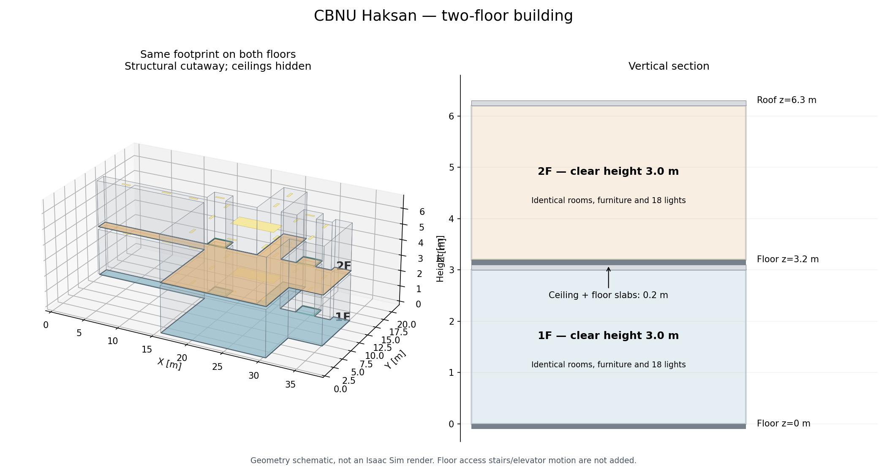
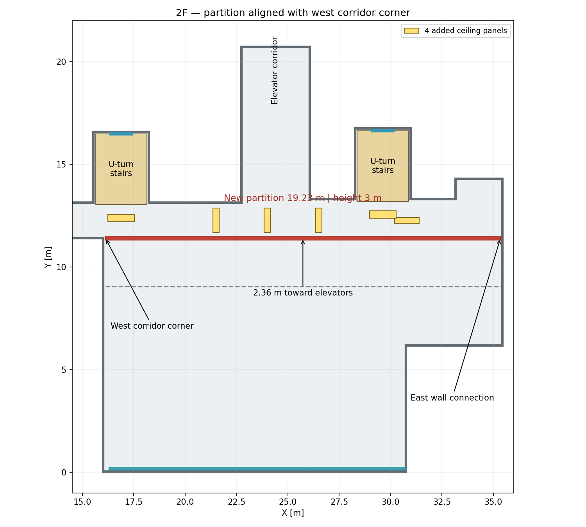

# CBNU 학연산 2층 건물 Isaac Sim 월드

충북대학교 학연산공동기술연구원의 로비·복도를 바탕으로 만든 **2층 건물 월드**다. 1층에는 가구·출입문·전시물·택배 상자를 유지하고, 2층은 가구와 전시물을 비운 공간에 가벽을 설치했다. 로비 양쪽 계단은 층 사이 중간참에서 180° 돌아 1층과 2층을 연결한다.

피난안내도와 현장 이미지를 바탕으로 비율과 동선을 근사한 환경이며 실측 CAD 모델은 아니다. 이 문서는 **2026-09-18 기준 생성된 2층 월드**를 설명한다.



미리보기 이미지는 생성 형상을 표시한 구조도이며 Isaac Sim 렌더 화면은 아니다.

## 월드 열기

Isaac Sim에서 다음 파일을 연다.

**[cbnu_haksan_2f_building.usda](worlds/cbnu_haksan_2f_building/cbnu_haksan_2f_building.usda)**

```text
/home/a/Isaac_Worlds_CBNU/worlds/cbnu_haksan_2f_building/cbnu_haksan_2f_building.usda
```

- USD 참조는 상대경로를 사용한다. 저장소를 옮길 때는 `assets/`와 `worlds/`를 함께 유지한다.
- 수정한 하위 레이어가 반영되지 않으면 Stage를 닫고 위 파일을 다시 연다.
- [1층 원본 Stage](worlds/cbnu_haksan_1f_corridor/cbnu_haksan_1f_corridor.usda)를 열면 원본 1층만 보인다. 최신 계단과 2층 수정은 2층 Stage에 적용되어 있다.

## 현재 건물 구성

좌표 단위는 미터이고 위쪽 축은 Z다.

| 항목 | 현재 값 |
| --- | --- |
| 1층 바닥 | z = 0m |
| 층간 높이 / 2층 바닥 | 3.2m / z = 3.2m |
| 층별 실내 높이 | 3.0m |
| 지붕 상단 | z = 6.3m |
| 층간 벽 연결부 | 높이 0.2m, 22개 |
| 계단 | 좌우 대칭 2개, 중간참 높이 1.6m |
| 패널 조명 | 1층 16개 + 2층 21개 + 중간참 2개 = 39개 |
| 물리 환경 | PhysicsScene 1개, DomeLight 1개 |
| 동적 물체 | 1층 택배 상자 16개 |

계단 개구부를 제외한 곳에서 1층 천장과 2층 바닥은 z=3.1m에서 맞닿는다. 계단실은 두 층에 걸쳐 열려 있으며 양층 외벽과 지붕도 계단실 깊이에 맞춰 확장했다.

### 층별 차이

| 구분 | 1층 | 2층 |
| --- | --- | --- |
| 일반 출입문 | 기존 배치 유지 | 제거 |
| 정면 유리 출입구 | 기존 유리문 유지 | 양옆 창문과 같은 크기의 고정창으로 교체 |
| 엘리베이터 문 | 2개 유지 | 2개 유지 |
| 소파·의자·책상·ATM | 기존 배치 유지 | 제거 |
| 우편물·택배 상자 | 동적 상자 16개 | 제거 |
| 디스플레이·회색 포스터·안내판 | 기존 배치 유지 | 제거 |
| 중앙 기둥 | 3개 유지 | 충돌 형상까지 제거 |
| 정문 측면 기둥 | 유지 | 유지 |
| 중앙 대형 조명·천장 에어컨 | 유지 | 제거 |
| 복도 가벽 | 없음 | 길이 약 19.23m, 높이 3m |
| 외부 보도 | 지상에 배치 | 없음 |

1층도 합성 월드에서는 계단실의 바닥·천장·외벽·조명이 변경된다. 보존되는 대상은 계단 공사 범위 밖의 기존 배치이며, 별도 1층 원본 파일은 그대로 유지한다.

### 양쪽 계단

| 항목 | 각 계단 규격 |
| --- | --- |
| 계단실 내부 폭 × 깊이 | 2.50 × 3.44m |
| 동선 | 1층 → 중간참에서 180° 회전 → 2층 |
| 중간참 높이 / 깊이 | 1.60m / 1.20m |
| 전체 단차 수 | 18개, 경사 구간별 9개 |
| 단 높이 | 약 0.1778m |
| 디딤판 깊이 / 두께 | 0.28m / 0.12m |
| 경사 구간 폭 | 1.10m |
| 부속 구조 | 경사 지지대, 양쪽 난간, 2층 개구부 가드 |
| 아래 공간 | 채움 형상을 없앤 개방 구조 |

입구에서 보면 왼쪽 계단은 왼쪽으로 올라가 오른쪽으로 2층에 도착하고, 오른쪽 계단은 그 반대다. 계단 위 1층 천장과 2층 바닥에는 실제 메시 개구부가 있으며, 디딤판·중간참·난간·지지대에는 정적 충돌을 설정했다.

[왼쪽 계단 구조도](worlds/cbnu_haksan_2f_building/preview_left_staircase.png) · [오른쪽 계단 구조도](worlds/cbnu_haksan_2f_building/preview_right_staircase.png) · [계단 변경 기록](docs/31.56_cbnu_haksan_staircases.md)

### 2층 가벽과 정면 창문

가벽은 서쪽 복도 벽선과 일자로 이어져 반대쪽 벽까지 닿는다. 중심선은 y=11.4103m, 길이 19.2347m, 두께 0.2m이며 바닥 z=3.2m부터 천장 z=6.2m까지 막는다. 기존 코너와 어긋나지 않도록 배치했고 충돌 형상을 포함한다.

정면 유리 출입문 자리는 양옆 창문과 같은 **4.85 × 2.82m 고정창 모듈**과 하부 벽으로 교체했다. 세 창의 중심 간격은 각각 4.725m이며 기존 측면 창과 정문 기둥은 유지한다.



### 조명과 재질

1층에는 중앙 대형 조명을 포함한 패널 16개가 있다. 계단 개구부 아래의 기존 천장등 2개는 비활성화하고 각 중간참에 조명을 설치했다. 2층은 중앙 대형 조명을 제거한 뒤 복도 조명 4개를 보강해 패널 21개를 사용한다.

- 2층 기존 복도·엘리베이터 조명 5개의 intensity는 8000에서 12000으로 높였다.
- 추가 복도 조명 4개도 intensity 12000을 사용한다.
- 복도 중앙 조명 3개(`CeilingLight_18`–`20`)는 긴 변이 복도 폭 방향인 Y축을 향하도록 90° 회전했다.
- 2층 계단실 조명은 확장된 중간참 위에 배치했다.
- 바닥은 광택 석재, 천장은 흰색 무광, 벽·가벽은 회색 재질을 사용한다. 계단은 회색 석재와 어두운 금속 난간으로 구성된다.

## USD 구성과 수정 위치

2층 Stage는 1층 원본을 지상과 `/World/Floor_02`에 각각 참조한다. 2층 전용 배치와 비활성화 설정은 최상위 파일에, 양쪽 계단과 건물 개구부는 `config/staircases.usda`에 작성된다.

주요 활성 경로는 다음과 같다. 비활성화된 원본 객체는 아래 목록에서 생략했다.

```text
/World
├── PhysicsScene
├── DomeLight
├── Looks
├── Environment                 # 1층 바닥·천장·벽·조명
├── Columns                     # 1층 중앙 및 정문 기둥
├── Architecture                # 1층 전시물·엘리베이터 문 등
├── Furniture
├── DynamicObstacles            # 택배 상자 16개
├── Doors
├── SpawnPoints
├── Floor_02                    # Z 방향 3.2m 이동
│   ├── Looks
│   ├── Environment
│   │   ├── Floor / Ceiling / Walls
│   │   ├── CeilingLights
│   │   ├── FrontEntranceGlassWalls
│   │   └── PartitionWall_01
│   ├── Columns                 # 정문 측면 기둥 유지
│   ├── Architecture            # 엘리베이터 문·기존 목재 가벽 유지
│   └── SpawnPoints
├── InterFloorBand              # 층간 벽 연결부 22개
├── Stairs_Left
└── Stairs_Right
```

| 수정 대상 | 수정할 파일 |
| --- | --- |
| 2층 객체 표시 여부, 가벽, 창문, 복도 조명 | [update_cbnu_haksan_two_floor.py](scripts/update_cbnu_haksan_two_floor.py) |
| 계단 치수·방향·난간·중간참, 계단실 확장·개구부 | [build_cbnu_haksan_staircase.py](scripts/build_cbnu_haksan_staircase.py) |
| 원본 벽·바닥·천장 형상 | [1층 Stage](worlds/cbnu_haksan_1f_corridor/cbnu_haksan_1f_corridor.usda), [geometry.json](worlds/cbnu_haksan_1f_corridor/config/geometry.json) |
| 원본 문·가구·조명·전시물·택배 배치 | [1층 config 디렉토리](worlds/cbnu_haksan_1f_corridor/config) |
| 공용 형상과 재질 | [assets 디렉토리](assets) |

생성된 2층 Stage와 `staircases.usda`는 재생성할 때 덮어쓴다. 영구적으로 유지할 변경은 생성 스크립트에 반영한다. 1층 원본 변경은 두 층에 참조되지만 2층 및 계단 레이어가 덮어쓴 부분에는 그대로 적용되지 않을 수 있다.

`geometry.json`만 바꿔서는 원본 벽과 바닥 형상이 자동 재생성되지 않는다. 층 높이·외곽 벽·계단실 치수를 바꿀 때는 원본 Stage, 두 생성 스크립트의 치수, 검증 기준을 함께 확인한다.

## 재생성

기존 월드를 여는 데 재생성은 필요하지 않다. 생성 스크립트를 수정했다면 저장소 루트에서 실행한다.

```bash
cd /home/a/Isaac_Worlds_CBNU
python3 -B scripts/update_cbnu_haksan_two_floor.py
```

이 명령은 계단 레이어와 2층 Stage를 함께 만든다. 생성에는 Python 표준 라이브러리를 사용한다.

구조도 갱신에는 NumPy와 Matplotlib이 필요하다.

```bash
MPLCONFIGDIR=/tmp/cbnu_matplotlib python3 -B scripts/render_cbnu_haksan_two_floor_preview.py
MPLCONFIGDIR=/tmp/cbnu_matplotlib python3 -B scripts/render_cbnu_haksan_staircase.py
```

1층 원본 배치 JSON을 수정한 경우에는 해당 생성기를 먼저 실행하고, 그다음 2층 월드를 재생성한다.

| 원본 설정 | 대응 생성기 (`scripts/` 아래) |
| --- | --- |
| `doors.json` | `update_cbnu_haksan_doors.py` |
| `furniture.json` | `update_cbnu_haksan_furniture.py` |
| `dynamic_obstacles.json` | `update_cbnu_haksan_dynamic_obstacles.py` |
| `ceiling.json` | `update_cbnu_haksan_ceiling.py` |
| `architecture.json` | `update_cbnu_haksan_architecture.py` |

## 검증

현재 2층 Stage와 양쪽 계단을 검사한다.

```bash
cd /home/a/Isaac_Worlds_CBNU
./scripts/test_world_with_isaac_usd.sh scripts/test_two_floor_world.py
```

래퍼는 기본적으로 `/home/a/isaacsim`의 Kit Python과 `omni.usd.libs`를 사용한다. 설치 위치가 다르면 `CBNU_ISAAC_ROOT` 환경변수를 실제 Isaac Sim 경로로 지정한다. 스크립트 인자를 생략하면 **1층 원본 검사**가 실행되므로 2층 검사에서는 위 인자를 포함한다.

2026-09-18에 현재 생성 파일로 확인한 결과:

| 검사 | 결과 |
| --- | --- |
| 2층 USD 합성, 층 높이, 연결부 22개 | PASS |
| 공통 형상·재질 107개 비교 및 1층 보존 대상 확인 | PASS |
| 2층 객체 제거·엘리베이터 문 유지·고정창 간격 | PASS |
| 가벽의 벽·바닥·천장 접합과 조명 배치 | PASS |
| 패널 조명 39개, 물리 환경 1개, 지상 동적 상자 16개 | PASS |
| 양쪽 계단 위치·단차·중간참·바닥 개구부 | PASS |
| 계단 메시 폐합·충돌 설정·아래 공간·중심 동선 위 2m 여유 | PASS |

검사 코드는 [test_two_floor_world.py](scripts/test_two_floor_world.py)와 여기서 호출하는 [test_cbnu_haksan_staircase.py](scripts/test_cbnu_haksan_staircase.py)에 있다. 위 결과는 USD 형상·속성에 대한 검사이며 실제 로봇의 계단 주행 결과를 뜻하지 않는다.

1층 원본을 수정했을 때의 별도 검사:

```bash
python3 -B scripts/validate_cbnu_haksan_detail.py
./scripts/test_world_with_isaac_usd.sh scripts/test_world.py
```

## 현재 동작 범위

바닥·천장·외곽 벽·2층 가벽·계단에는 충돌 형상이 있다. 1층 택배 상자 16개는 질량과 충돌을 가진 동적 강체다. 엘리베이터 문은 닫힌 상태의 시각 형상이며 기존 벽 collider를 사용한다.

로봇 배치·제어 정책 연결, 실제 계단 주행 검증, 엘리베이터 이동 및 문 개폐 애니메이션은 구현·검증 범위에 포함하지 않는다. 생성된 Stage의 최종 GUI 반영 여부는 별도로 확인해야 한다.

## 저장소 구조

```text
Isaac_Worlds_CBNU/
├── README.md
├── assets/                               # 공용 형상·재질
├── worlds/
│   ├── cbnu_haksan_1f_corridor/           # 1층 원본과 배치 설정
│   │   ├── cbnu_haksan_1f_corridor.usda
│   │   ├── config/
│   │   └── reference/
│   └── cbnu_haksan_2f_building/          # 현재 사용할 월드
│       ├── cbnu_haksan_2f_building.usda
│       ├── config/staircases.usda
│       └── preview_*.png
├── scripts/                              # 생성·구조도·검증
├── docs/                                 # 번호별 변경 기록
└── terrains/
```

## 관련 변경 기록

- [2층 건물 합성](docs/31.43_cbnu_haksan_two_floor_building.md)
- [2층 정면 고정창](docs/31.45_cbnu_haksan_upper_entrance_window.md)
- [2층 문·가구·택배 제거](docs/31.46_cbnu_haksan_upper_floor_clear.md) · [디스플레이·안내판 제거](docs/31.47_cbnu_haksan_upper_displays_clear.md)
- [엘리베이터 문 복원](docs/31.48_cbnu_haksan_upper_elevators_restore.md) · [중앙 기둥 제거](docs/31.49_cbnu_haksan_upper_columns_clear.md)
- [가벽 코너 정렬](docs/31.53_cbnu_haksan_partition_corner.md)
- [복도 조명 보강](docs/31.54_cbnu_haksan_upper_corridor_lighting.md) · [중앙 조명 세로 배치](docs/31.55_cbnu_haksan_corridor_light_rotation.md)
- [양쪽 계단과 아래 공간 개방](docs/31.56_cbnu_haksan_staircases.md)

변경 기록과 1층 원본 미리보기에는 당시 상태가 남아 있다. 현재 배치는 이 README와 2층 Stage를 기준으로 확인한다.
